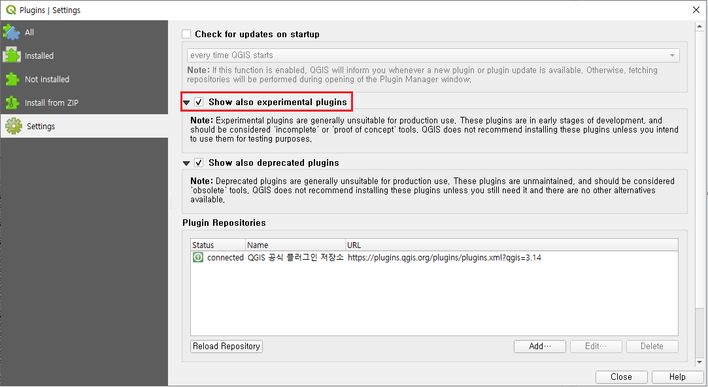
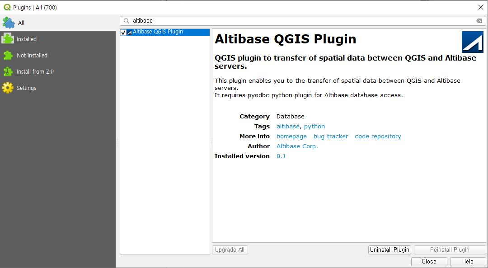
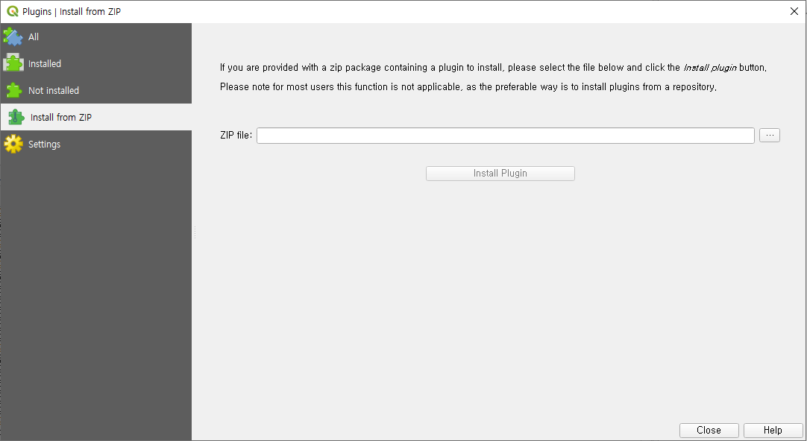
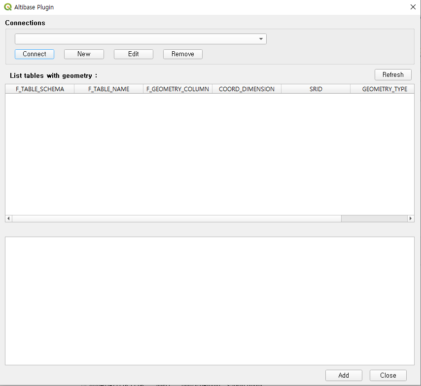

# Altibase-QGIS-Plugin

## 개요 

이 문서는 Altibase QGIS Plugin 설치 및 사용법에 대해 설명한다.

이 문서는 아래 버전을 기준으로 작성되었다.

- Windows 7 이상
- Altibase 7.1.0 이상
- QGIS 3.12.0 이상

Altibase QGIS Plugin을 사용하기 위해서는 다음 항목이 사전에 설치되어 있어야 한다.

- Altibase ODBC Driver
- pyodbc

## Altibase QGIS Plugin 설치 

1. QGIS의 플러그인 메뉴에서 검색하여 설치할 수 있다.

   

   

2. 본 페이지의 Code -> Download ZIP을 다운로드 받은 후 QGIS의 플러그인 메뉴에서 'Install from ZIP' 으로 설치가 가능하다.

   
   

## Connecting to Altibase 

- 사전에 Altibase ODBC Driver와 pyodbc가 설치되어 있어야 한다.
- 'ODBC 데이터 원본 관리자'에 Altibase로 연결하는 DSN이 등록되어 있어야 한다.

 

1. Altibase QGIS Plugin 설치가 완료되면 Plugins -> Altibase QGIS Plugin을 실행한다.

   

2. New 버튼을 클릭하여 새로운 커넥션 정보를 생성한다.  
   이때, DSN은 'ODBC 데이터 원본 관리자'에 등록된 DSN이어야 한다.  
   Options에 세션 프로퍼티를 설정할 수 있다.  
   예시) timeout=3;connection_timeout=60  
   Altibase 접속에 필요한 모든 정보 입력 후 'Test Connection'을 해보고 성공하면 OK버튼을 누른다.

3. Altibase QGIS Plugin Dialog로 돌아와서 커넥션 이름을 확인하고 Connect 버튼을 클릭한다. Altibase로 연결이 성공하면 geometry tables 목록이 나타난다.

4. 특정 테이블을 클릭하면 해당 테이블의 레코드 정보를 확인할 수 있다.

## Add Layer 

- Altibase QGIS Plugin Dialog에서 특정 테이블을 더블클릭하거나 선택 후 Add 버튼을 클릭하면 QGIS에 Vector Layer가 추가된다. 이 레이어 타입은 Temporary scratch layer이다. 
- 여러 개의 레이어를 동시에 추가하기 위해서는 하나 이상의 테이블을 선택하고 Add 버튼을 클릭한다.
- 1개 테이블에 하나 이상의 geometry type을 포함하는 경우, 각 geometry type별로 레이어가 추가된다.

 

 

## Edit & Save Layer 

- Altibase DB에서 불러온 레이어를 선택하고 'Toggle Editing'을 클릭한다.
- Editing 상태에서 feature를 추가/변경/삭제 후 저장하면 변경사항이 Altibase DB에 저장된다.

 

 

## 고려사항 

1. Altibase DB에서 불러온 레이어는 Temporary scratch layer이므로 Project로 저장할 수 없다.   
   Project로 저장하기 위해서는 ESRI shapefile 등 다른 타입으로 export 후 저장해야 한다.  
2. Altibase DB에서 불러온 레이어의 Attribute 추가, 수정 그리고 삭제 사항은 Altibase DB에 저장되지 않는다.  
3. Altibase DB에서 불러온 레이어 Feature의 Primary Key Attribute 값 수정은 지원하지 않는다.  
4. Altibase DB에서 지원하지 않는 Geometry type은 Altibase DB에 저장할 수 없다.  
5. Altibase DB의 SQL 쿼리 버퍼 크기를 초과하는 WKB Geometry를 가진 Feature는 Altibase DB에 저장할 수 없다.  

